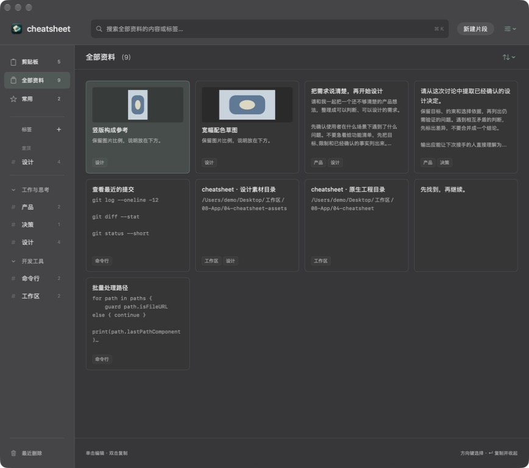
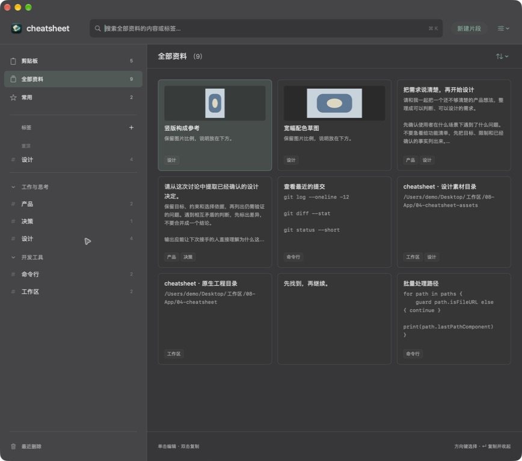
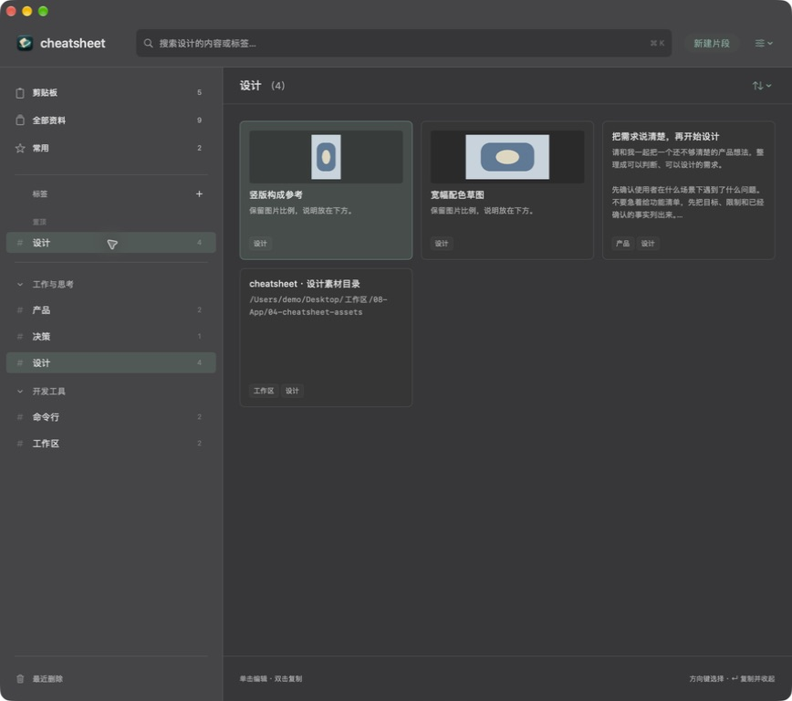
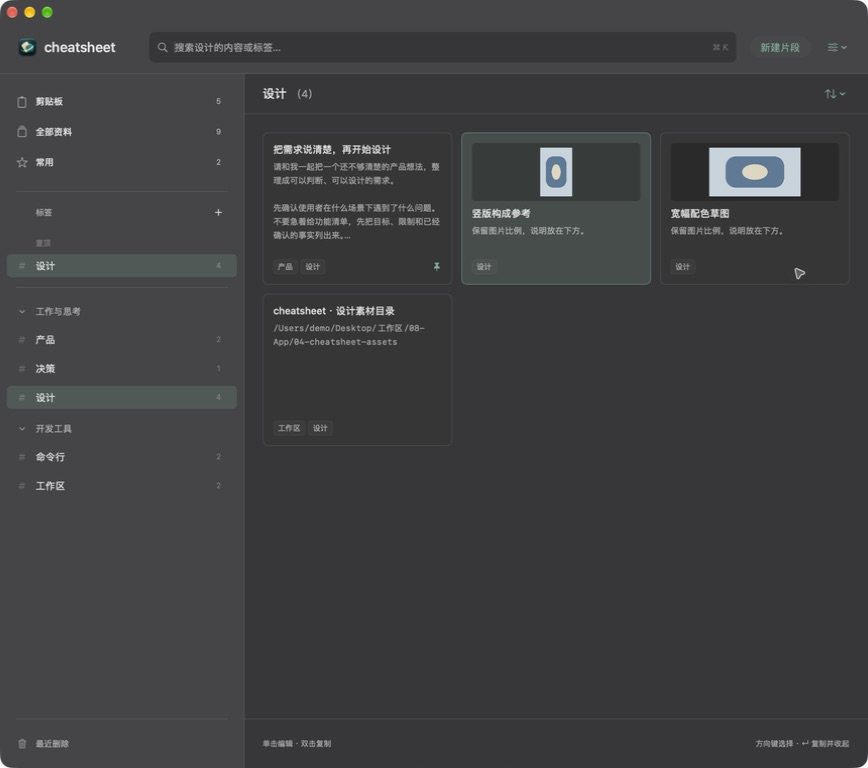
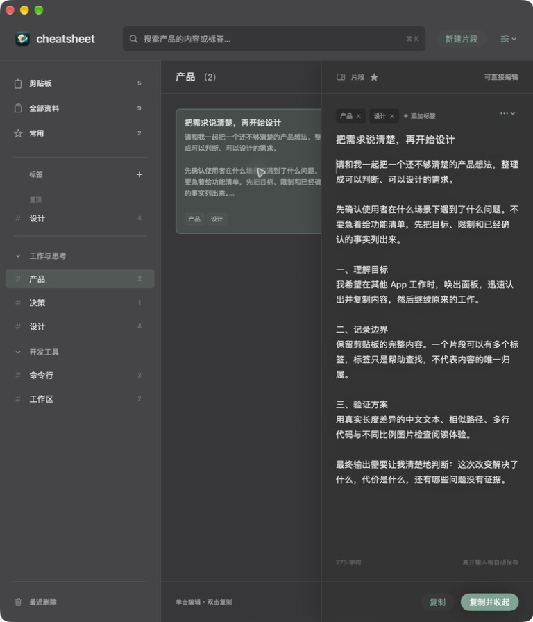

# 侧栏调宽与标签内片段置顶

关联 [Issue #11](https://github.com/airsulG/cheatsheet/issues/11) / [PR #12](https://github.com/airsulG/cheatsheet/pull/12)。本轮实施从 main `883ae7dca6c7bc4a96e1264964513527a3163479` 开始，分支 `codex/sidebar-width-tag-pins`。2026-09-15 完成代码、隔离功能检查和本地构建；Karl 随后明确回复“验收通过”，完成本轮体验验收。尚未合并或替换日常 App。

## 实现版本与边界

| 提交 | 内容 |
|---|---|
| `e962229` | 侧栏原生分隔控件、上下限、偏好持久化和控件测试 |
| `267bdb5` | 标签内置顶、v3 数据模型与备份、排序与失败保护、迁移检查 |
| `c898158d0d2e6e0b5eb470089f9f90742e1e22d6` | 修复 160pt 时“全部资料”换行；最终应用源代码版本 |

侧栏默认 188pt，最小 160pt，最大 min(320pt, 内容宽度 × 30%)。拖动只改变宽度状态，松手才写偏好；窄窗口临时限制和无变化的点击都不覆盖偏好。控件支持辅助功能每次增减 10pt。原有卡片 200pt 高、12pt 间距、单击编辑和双击复制保持不变。

置顶按“片段 + 当前选中的单个标签”保存，不是跨标签的 TagGroup，也不是全局常用或标签本身的置顶。仅具体标签下的片段右键菜单提供操作。搜索先筛选，再按置顶优先、当前排序、同值对象 ID 排列；手动移动不跨越置顶与普通部分。置顶本身不改正文时间或全局顺序。

主动移除标签关联时清除该标签内置顶，再加入不会自动置顶。软删除标签或片段保留关系，恢复后继续生效；标签已软删除时编辑正文不会丢掉隐藏关系。持久化失败恢复本次字段并显示错误，不回滚其他待保存修改。Core Data v3 保留 v1/v2；备份 v3 的 pinnedTagIDs 可选，旧备份缺少字段即未置顶，导入只映射到本次新建且确实属于片段的标签。

## 可重复检查

使用 `/Applications/Xcode-beta.app/Contents/Developer`，没有更改系统默认 Xcode。Debug 和 Release 均 BUILD SUCCEEDED。Debug 独立 bundle ID `zhouqiaaha.top.cheatsheet.cabinet-preview.issue11`；预览使用内存数据和命名剪贴板，不启动真实采集或自动备份。

```sh
DEVELOPER_DIR=/Applications/Xcode-beta.app/Contents/Developer xcodebuild -project cheatsheet.xcodeproj -scheme cheatsheet -configuration Debug -destination 'platform=macOS' -derivedDataPath /tmp/cheatsheet-issue11-build PRODUCT_BUNDLE_IDENTIFIER=zhouqiaaha.top.cheatsheet.cabinet-preview.issue11 CODE_SIGNING_ALLOWED=NO SWIFT_OPTIMIZATION_LEVEL=-O ENABLE_TESTABILITY=YES build
DEVELOPER_DIR=/Applications/Xcode-beta.app/Contents/Developer python3 scripts/verify_core_behaviors.py /tmp/cheatsheet-issue11-build --organization
DEVELOPER_DIR=/Applications/Xcode-beta.app/Contents/Developer python3 scripts/verify_core_behaviors.py /tmp/cheatsheet-issue11-build --cabinet
DEVELOPER_DIR=/Applications/Xcode-beta.app/Contents/Developer python3 scripts/verify_core_behaviors.py /tmp/cheatsheet-issue11-build
DEVELOPER_DIR=/Applications/Xcode-beta.app/Contents/Developer xcodebuild -project cheatsheet.xcodeproj -scheme cheatsheet -configuration Release -destination 'platform=macOS' -derivedDataPath /tmp/cheatsheet-issue11-release CODE_SIGNING_ALLOWED=NO build
```

三组检查均退出 0。组织功能检查在最终应用版本重新执行；资料柜与基础检查在相同模型/交互实现上通过，后续应用差异只有导航文字单行约束与 Spacer 的最小值，由最终 Debug / Release 和最窄窗口截图验证。[检查输出](checks.txt) 保留实际结果；其中旧资料柜脚本的“v2 JSON roundtrip”日志文案已改为“current JSON”，实际创建的是当前 v3，专门的组织检查另行覆盖缺少新字段的 v2。

| 验收对象 | 证据与结果 |
|---|---|
| 调宽范围与偏好 | 原生 NSHostingView 中直接发送分隔控件事件，验证 228→280→300→320→310→160；拖动未结束偏好不变，无变化点击不写，缩小/放大恢复，辅助功能增减可用 |
| 标签独立与排序 | A/B 两标签三片段，三种排序、多置顶、同值重复刷新、全文搜索、全部/常用隔离、连续十次切换最终状态；全局顺序和时间不变 |
| 生命周期 | 标签改名、标签/片段软删除再恢复、隐藏标签期间编辑、主动移除再加入均验证 |
| 保存失败 | 注入保存异常，分别验证置顶、取消置顶、移除标签关联失败；原字段、原置顶和其他未提交正文保留，重试可落盘 |
| 备份兼容 | v3 JSON 回读、同名标签导入后新 ID 映射、v2 缺字段、无效/非成员标签 ID 过滤；基础检查兼容 v1 |
| 数据迁移与重开 | 真实临时 v2 SQLite 升级到 v3，保留 ID、Unicode 正文、图片、时间、标签、原常用与标签置顶；写新置顶后关闭再打开数据库仍存在；原资料柜检查另覆盖 v1 SQLite 升级 |
| 编辑与复制回归 | 原资料柜检查覆盖全文复制、末尾搜索、剪贴板格式、背景合并、失焦保存、失败草稿、组合输入、搜索焦点、Esc、双击覆盖区域、提示/声音规则和十次中途反向面板切换 |

Release 可执行文件 SHA-256：`f92b980d71b86d107adc1b73f645614532a962a1ff9dff8533344674db0e722f`。构建产物保存在 `/tmp/cheatsheet-issue11-release/Build/Products/Release/cheatsheet.app`；未运行正式模式，未迁移用户日常数据库，未进行安装或签名发布。

## 实际窗口检查

使用 CUA 操作独立预览窗口，内置 9 条片段、5 个标签、5 条剪贴板样本。鼠标实际拖动边界至 320pt，再向左拖至 160pt；侧栏未切换标签，输入焦点仍在搜索框。退出并重新启动隔离 App 后，辅助功能读到 160pt。最小宽度复查发现主导航换行，修正后重新构建、启动并截图，主导航恢复单行。

系统 Window → Move & Resize → Left 将窗口收窄，偏好 320pt 临时显示 255.9pt，正文编辑可用；Return to Previous Size 后恢复 320pt。单击打开编辑立即获得正文焦点，Esc 收起。宽窄窗口的卡片、标签和正文没有交叠。这里确认布局与功能，不用截图推断帧率。

在“设计”中对“把需求说清楚，再开始设计”右键置顶，卡片从第三位移到第一位并显示图钉；切到“产品”无图钉。最终构建再次验证置顶、双击出现“已复制到剪贴板”、取消后回到第三位。全局常用和左侧“设计”标签自身置顶未改变。

| 最小侧栏 | 最大侧栏 |
|---|---|
|  |  |

| 置顶前 | 置顶后 |
|---|---|
|  |  |



## 拖动记录与体验证据限制

实际 CUA 拖动及窗口变化顺序为：默认 188→拖至 320→半屏临时 255.9→恢复 320→拖至 160→退出重启仍 160。最终构建另从 160 拖至 320，并尝试同时采集连续截图。[时间记录](drag-trace.json) 显示 drag 调用 582ms 返回，首张截图在 1064ms 才返回，后续为 1145–1559ms；[第 0 张](drag-0.jpg) 至 [第 7 张](drag-7.jpg) 都是操作结束后的采样。它们不能组成有效的过程录像，也不能证明逐帧流畅度。

原生事件检查证明中间宽度会更新、达到边界后停止，不等待 mouseUp 才改变布局；代码中的拖动回调不包含查询、保存、计时器或追赶动画。新增的布局成本是侧栏宽度变化引起的网格换列，静止时没有持续任务。首次交付时因缺少逐帧录像或 FPS 测量，保留人工体验确认项。

2026-09-15，Karl 在获知上述工具限制后明确回复“验收通过”。这条人工验收结论补齐拖动观感确认，连同前述隔离功能、数据和窗口检查，本轮实施与验收完成。它不代表已经取得录像或 FPS 测量；原始采样和工具限制继续保留。用户日常数据库迁移、安装和合并属于后续交付决定。
