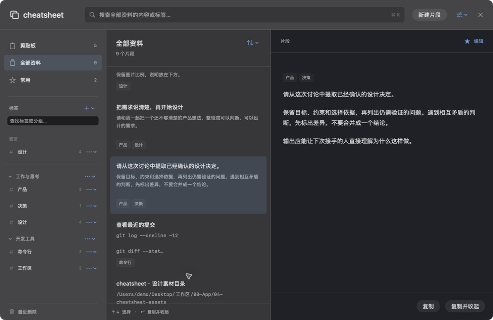
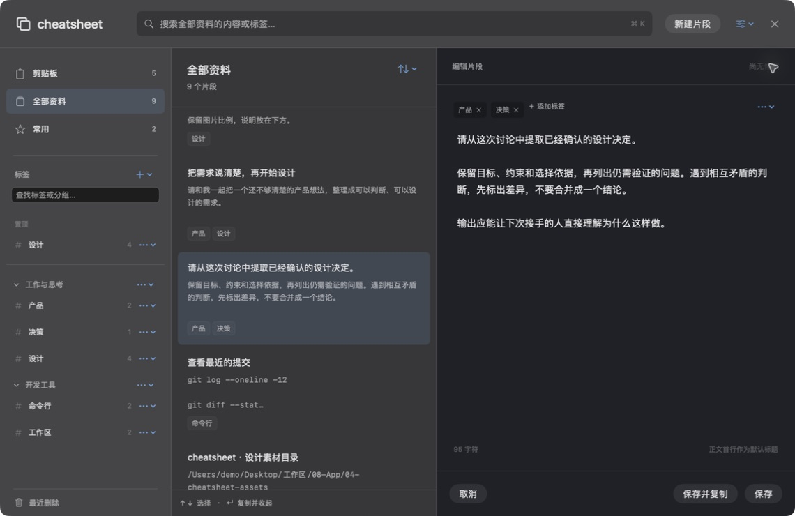
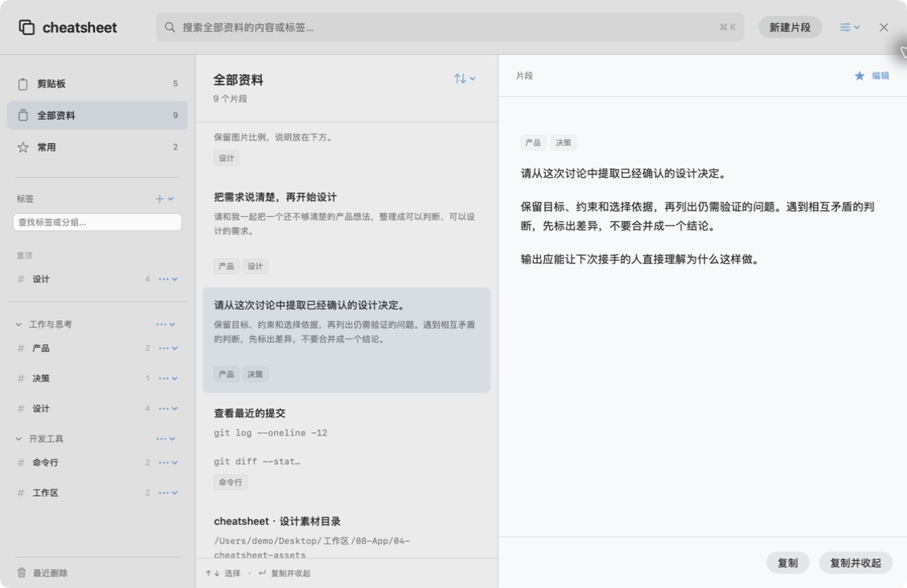
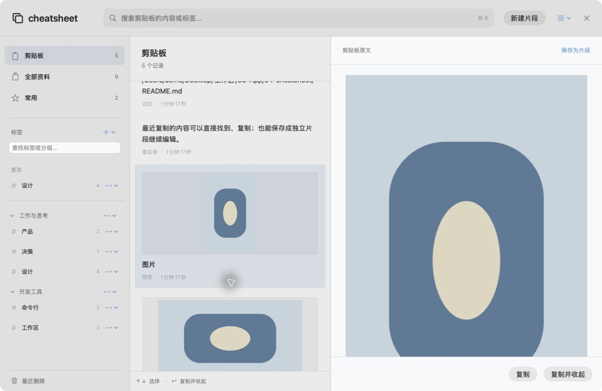

# Issue #7 原生资料柜验证

后续体验修订见 [设置风格、红绿灯与卡片复制验证](feedback.md)。下文保留首轮代码与截图，不代表后续修订后的最新外观。

最新点击规则与卡片边界见 [整卡复制验证](whole-card.md)，它替代首轮及第一次反馈中关于独立复制按钮的解释。

对应 [Issue #7](https://github.com/airsulG/cheatsheet/issues/7)。验证日期：2026-09-14；实现代码：`f097cd3f55fa2dd13e900102bf9383f66c68aa1a`，基线：`0e4cfff16808df7c9e7611d5639608bd00452366`。随后提交仅整理文档与这里的运行截图。验证由实施 Agent 完成，不代表独立审查或 Karl 已验收。

## 构建与行为检查

本机使用 `/Applications/Xcode-beta.app/Contents/Developer`；系统默认 xcode-select 指向 CommandLineTools，因此每条构建与验证命令显式指定 DEVELOPER_DIR。

```sh
DEVELOPER_DIR=/Applications/Xcode-beta.app/Contents/Developer \
xcodebuild -project cheatsheet.xcodeproj -scheme cheatsheet \
  -destination 'platform=macOS' \
  -derivedDataPath /tmp/cheatsheet-cabinet-v2-build \
  CODE_SIGNING_ALLOWED=NO build

DEVELOPER_DIR=/Applications/Xcode-beta.app/Contents/Developer \
python3 scripts/verify_core_behaviors.py /tmp/cheatsheet-cabinet-v2-build

DEVELOPER_DIR=/Applications/Xcode-beta.app/Contents/Developer \
python3 scripts/verify_core_behaviors.py /tmp/cheatsheet-cabinet-v2-build --cabinet
```

构建结果为 `BUILD SUCCEEDED`，两个行为检查命令均退出 0，Core Data 并发断言已开启。`git diff --check` 通过。构建日志留在本机 `/tmp/cheatsheet-cabinet-v2-build.log`。

原有行为检查输出：

```text
PASS: swap, invalid indices, title order, numeric order and persisted readback
PASS: title, full body tail, case, trim, no match, empty query and child observation
PASS: backup/archive import round-trip in isolated memory stores
PASS: borderless panel key status and field editor text input
PASS: JSON import contract, command creation and full-content readback
```

资料柜行为检查输出：

```text
PASS: v1 SQLite migration preserves IDs, full body, title, order, favorite and pin; adds tag relation
PASS: multi-tag, optional title, no-tag save, non-destructive deletion, rename and group restore conflicts
PASS: history source dedup and original protection; v2 JSON roundtrip covers groups, images, no tags and origin; imports v1
PASS: original file URL, URL, RTF and HTML payloads survive copying
PASS: full-body tail search, exact copy on isolated pasteboard, clipboard query and selection restoration
PASS: background clipboard save merges on main and becomes searchable without reopening
PASS: disk store closes and reopens with image and multi-tag assets intact
```

此次独立磁盘夹具位于 `/var/folders/t6/vt9fqpjj0vd7zfc9gw42yvlw0000gp/T/cabinet-check-315911B1-3D2D-478E-9171-3455A47C86E6`。夹具从旧模型创建 SQLite，再由当前模型迁移并关闭重开；不读取用户原数据库。复制检查使用命名 NSPasteboard，不改系统剪贴板。

## 实际原生窗口验证

验收包通过下方命令构建成功，使用独立 bundle id 和本地签名：

```sh
DEVELOPER_DIR=/Applications/Xcode-beta.app/Contents/Developer \
xcodebuild -project cheatsheet.xcodeproj -scheme cheatsheet \
  -destination 'platform=macOS' \
  -derivedDataPath /tmp/cheatsheet-cabinet-acceptance \
  PRODUCT_BUNDLE_IDENTIFIER=zhouqiaaha.top.cheatsheet.cabinet-preview.acceptance \
  CODE_SIGN_IDENTITY=- CODE_SIGN_STYLE=Manual DEVELOPMENT_TEAM= build
```

运行包：`/tmp/cheatsheet-cabinet-acceptance/Build/Products/Debug/cheatsheet.app`。日志：`/tmp/cheatsheet-cabinet-acceptance.log`。这个 Debug 包使用模拟内容、内存存储与命名剪贴板，不启动真实剪贴板监控或自动备份；关闭后模拟修改不保留。真实持久化重启验证由上述独立磁盘检查承担。

| 操作 | 实际观察 |
|---|---|
| ⌘N 新建、输入正文、⌘S 保存 | 编辑器接收输入，列表数量更新，未填标题时使用首个非空行 |
| 选择多个标签、修改后切换 | 标签可多选；未保存提示中的“保存并继续”保存后才切换 |
| 在具体标签中新建 | 默认附上当前标签 |
| 新建分组、创建分组并加入标签 | 侧栏出现分组，标签进入对应分区 |
| 剪贴板文本和图片保存为片段 | 进入独立片段编辑；返回剪贴板后仍选中原记录，显示“查看已存片段” |
| 深浅模式、调整窗口大小 | 原生材质与正文外观切换；760×560 和 1140×740 窗口可浏览操作 |
| 从计算器按 ⌘⇧⌥C 唤出 | 资料柜显示且搜索接收焦点；回车复制并收起；再次唤出保留选中内容并显示复制反馈 |

隔离验收快捷键是 **⌘⇧⌥C**，普通 App 仍为 **⌘⇧C**。验收完成后保留一个验收进程，避免多个测试副本占用同一快捷键。`/Applications/cheatsheet.app` 未替换，其真实数据未参与测试。

## 实际运行截图

以下四张截图直接捕获上述原生验收窗口，使用模拟内容，尺寸为 1140×740；不是网页或生成图。深浅背景受当时桌面环境影响，磨砂本身使用 NSVisualEffectView。

深色阅读：小字号主导航、分组标签、正文首行标题和弱标签表达。



连续编辑：默认只有正文，不强制标题或内容类型；可添加多个标签。



浅色阅读：同一内容和结构切换为浅色。



剪贴板图片：保留图片比例，来源与说明上下排列。



## 验证边界与交付状态

这些结果证明已实现代码的构建、主要存储规则和列出的原生交互。未配置的 XCTest target 没有运行；没有把构建成功算作 XCTest 通过，也没有伪造 CI 或独立 Review。

中文正文通过原生可访问性输入并完成保存；实际中文输入法的组合输入全流程、屏幕阅读器、多显示器与全屏空间切换尚未完整验收。代码对 marked text 放行，但不能替代这些手动检查。未测量上万条资料的搜索延迟、长时间运行内存和帧率，不声称性能目标已达成。

剪贴板后台新增通过隔离 context 保存并验证主线程合并，没有在验收进程打开真实系统监控。文件 URL、URL、HTML、RTF 和文本复制使用命名剪贴板检查；图片保存、阅读与备份已检查，未声称所有图片格式逐字节一致。设置中真实清空、真实数据迁移和覆盖正式安装均未执行。

实现已可运行并供审查。Karl 的体验验收、正式合并和安装仍待后续决定；本记录不代表发布完成。
