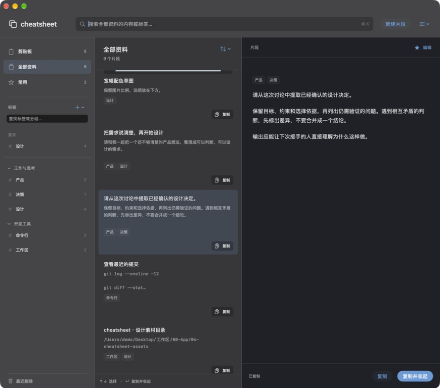
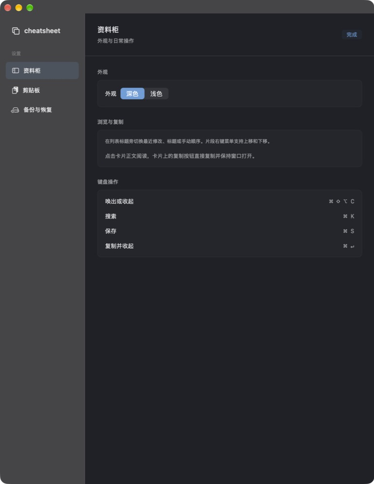
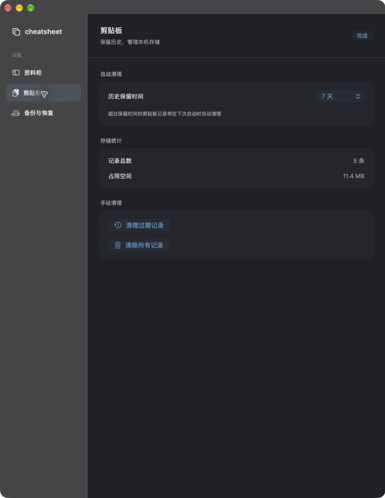
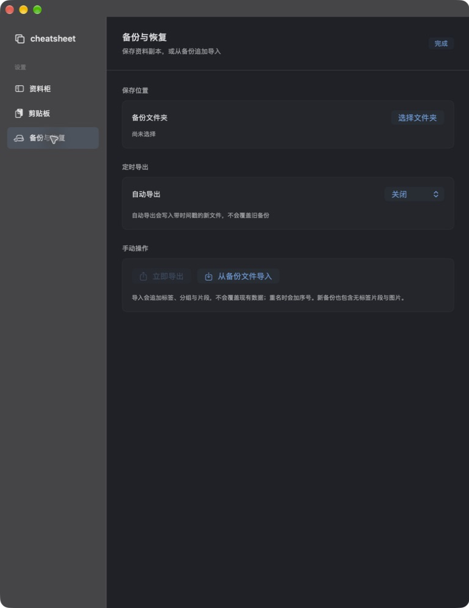
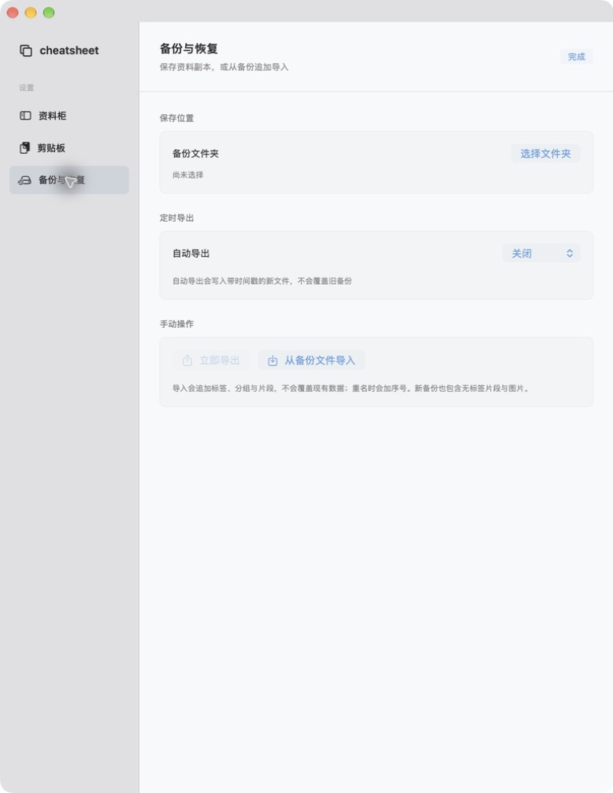

# 资料柜体验反馈修订

对应 Issue #7 / PR #8，2026-09-14。本轮实现提交 `90e8acd`，在此前 `70d7273` 基础上继续；下面的截图和测试对应本轮实现，上一级 README 保留首轮完整证据。

## 可观察变化

标签及分组行没有重复的更多按钮；右键仍包含置顶、改名、加入分组、新建和删除等管理操作。标签区顶部加号保留。每张结果卡片增加独立复制按钮，单击复制并显示“已复制”，窗口保持打开，正文点击仍用于阅读。

资料柜恢复 macOS 原生关闭、最小化和缩放按钮；红色关闭按钮复用未保存保护，黄色最小化后快捷键会恢复。设置、剪贴板设置与备份恢复改为统一的侧栏、阅读底色和轻边框分区；支持深浅切换。没有改动存储 schema、备份格式或监控逻辑。

## 验证

```sh
DEVELOPER_DIR=/Applications/Xcode-beta.app/Contents/Developer \
xcodebuild -project cheatsheet.xcodeproj -scheme cheatsheet \
  -destination 'platform=macOS' -derivedDataPath /tmp/cheatsheet-cabinet-feedback \
  PRODUCT_BUNDLE_IDENTIFIER=zhouqiaaha.top.cheatsheet.cabinet-preview.feedback \
  CODE_SIGN_IDENTITY=- CODE_SIGN_STYLE=Manual DEVELOPMENT_TEAM= build

DEVELOPER_DIR=/Applications/Xcode-beta.app/Contents/Developer \
python3 scripts/verify_core_behaviors.py /tmp/cheatsheet-cabinet-feedback

DEVELOPER_DIR=/Applications/Xcode-beta.app/Contents/Developer \
python3 scripts/verify_core_behaviors.py /tmp/cheatsheet-cabinet-feedback --cabinet
```

构建成功，两组检查均退出 0；旧数据迁移、备份兼容、复制格式、后台合并与重启回读继续通过。此次磁盘夹具为 `/var/folders/t6/vt9fqpjj0vd7zfc9gw42yvlw0000gp/T/cabinet-check-2BC85C13-C4E8-40BC-A0C4-626E390449E8`。本机构建日志 `/tmp/cheatsheet-cabinet-feedback.log`。`git diff --check` 通过。未新增只验证样式实现细节的单元测试。

实际原生窗口已验证卡片复制反馈和窗口保持打开、标签右键菜单、红色按钮触发未保存提示、继续编辑后保存、黄色最小化后的快捷键恢复，以及设置三页显示和深浅模式切换。没有执行真实数据清理、选取用户备份目录或导入用户文件；备份与导入底层行为由现有隔离检查覆盖。首轮记录中的中文输入法、多屏、屏幕阅读器和大数据量性能限制仍适用。

当前运行包为 `/tmp/cheatsheet-cabinet-feedback/Build/Products/Debug/cheatsheet.app`，使用模拟数据、命名剪贴板及 **⌘⇧⌥C** 快捷键；旧验收副本已退出，正式 `/Applications/cheatsheet.app` 保持原样。合并和正式安装尚未执行。

## 实际运行截图










