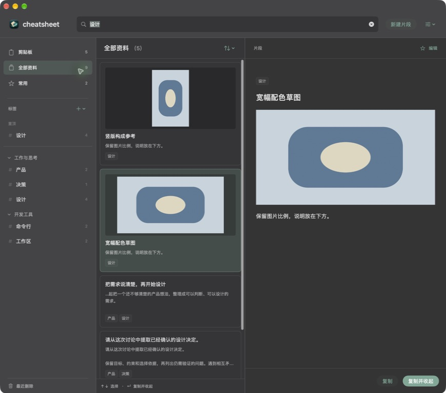
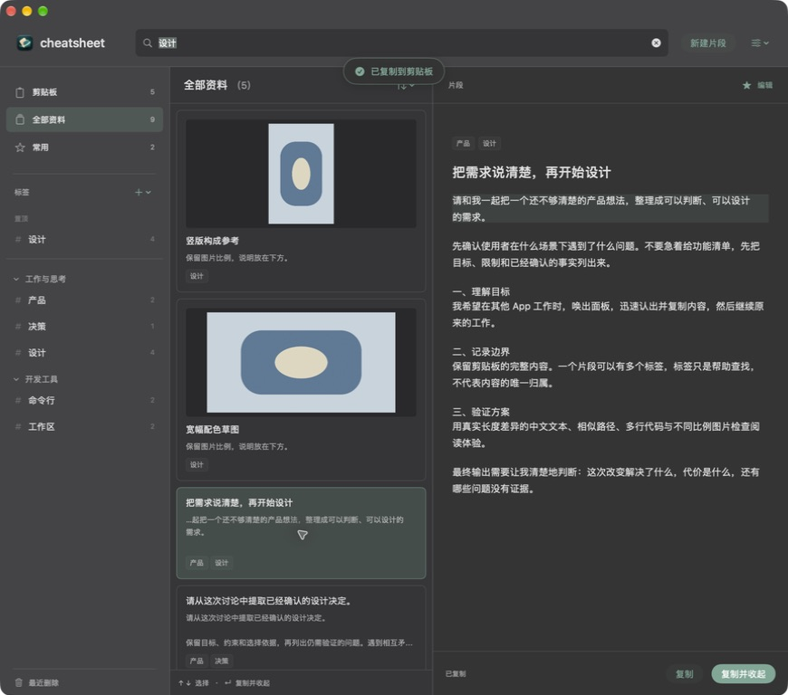

# 单击查看、双击复制与中文搜索

关联 Issue #7 / Draft PR #8。验证日期 2026-09-14，实现提交 `77230fd12b13ba5d5c8f2dab4be1854f1a2ac367`。本记录是实施 Agent 的本地验证，不代表 Karl 已验收或独立审查完成。

## 这次确认的行为

Karl 澄清：“单击我建议是展示内容 双击我建议是复制 而且给复制提供一个清晰的反馈”。整卡单击只切换右侧全文，双击复制，顶部显示两秒“已复制到剪贴板”，保持窗口打开。鼠标选择不再请求滚动；方向键选择及切换导航后的选中恢复仍可滚入可见范围，不使用居中锚点。

中列数量合并进标题，例如“全部资料（9）”，标题区域固定 52pt。标签字号 13pt，分组标题 12pt，侧栏标签查找框移除；顶部仍可搜索内容或标签。搜索使用原生 NSTextField，未提交的拼音不覆盖、不作为查询，也不截获候选阶段的回车。

## 构建与回归

```sh
DEVELOPER_DIR=/Applications/Xcode-beta.app/Contents/Developer \
xcodebuild -project cheatsheet.xcodeproj -scheme cheatsheet \
  -destination 'platform=macOS' \
  -derivedDataPath /tmp/cheatsheet-cabinet-input \
  PRODUCT_BUNDLE_IDENTIFIER=zhouqiaaha.top.cheatsheet.cabinet-preview.input \
  CODE_SIGN_IDENTITY=- CODE_SIGN_STYLE=Manual DEVELOPMENT_TEAM= build

DEVELOPER_DIR=/Applications/Xcode-beta.app/Contents/Developer \
python3 scripts/verify_core_behaviors.py /tmp/cheatsheet-cabinet-input --cabinet
```

构建 `BUILD SUCCEEDED`，日志 `/tmp/cheatsheet-cabinet-input.log`；资料柜检查退出 0，开启 Core Data 并发断言，`git diff --check` 通过。原有不带 --cabinet 的检查本轮未重复运行，不能将历史结果计为本轮执行。

```text
PASS: v1 SQLite migration preserves IDs, full body, title, order, favorite and pin; adds tag relation
PASS: multi-tag, optional title, no-tag save, non-destructive deletion, rename and group restore conflicts
PASS: history source dedup and original protection; v2 JSON roundtrip covers groups, images, no tags and origin; imports v1
PASS: original file URL, URL, RTF and HTML payloads survive copying
PASS: full-body tail search, exact copy on isolated pasteboard, clipboard query and selection restoration
PASS: background clipboard save merges on main and becomes searchable without reopening
PASS: mouse selection does not scroll; keyboard selection requests visibility; IME composition waits for Chinese commit
PASS: disk store closes and reopens with image and multi-tag assets intact
```

新增检查分别验证鼠标选择不增加滚动请求、键盘选择增加滚动请求，以及真实 NSTextView field editor 在 setMarkedText 后不提交查询、回车仍交给输入法、insertText 提交中文后更新查询。

## 实际原生窗口

当前隔离包 `/tmp/cheatsheet-cabinet-input/Build/Products/Debug/cheatsheet.app`，快捷键 ⌘⇧⌥C。真实按键依次输入 s、h、e、j、i：组合文字出现在搜索框内，结果不提前刷新；空格提交后，输入框显示“设计”，结果从全部 9 条变成 5 条。这不是通过粘贴或直接设置输入框值替代输入法验证。



双击路径卡片后，窗口保持打开，成功提示出现在可访问性树中。命名测试剪贴板 `cheatsheet-cabinet-preview` 的 changeCount 从 45 到 47，内容从 `git diff --stat` 变为 `/Users/demo/Desktop/工作区/08-App/04-cheatsheet/README.md`，与双击对象完全一致。再次双击长提示词时捕获下图：右侧展示全文，顶部显示复制成功。单击仅切换右侧全文，代码及新增检查确保鼠标选择不再调用滚动请求；未声称逐像素测量滚动偏移。



所有检查使用隔离数据和命名剪贴板，没有覆盖正式 App、迁移真实数据库或写入系统剪贴板。本轮实际窗口验证为深色；基础拼音路径已验证，其他输入法、复杂候选操作、辅助功能、多屏及大量资料性能仍未全面验收。保留 Draft，未合并或发布。
