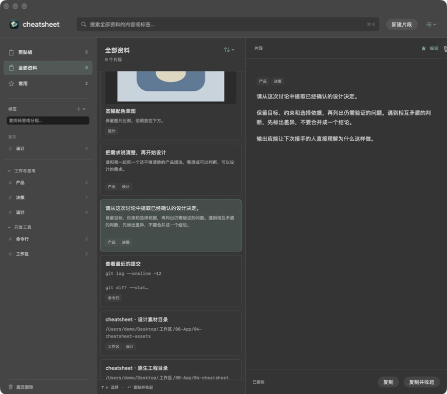
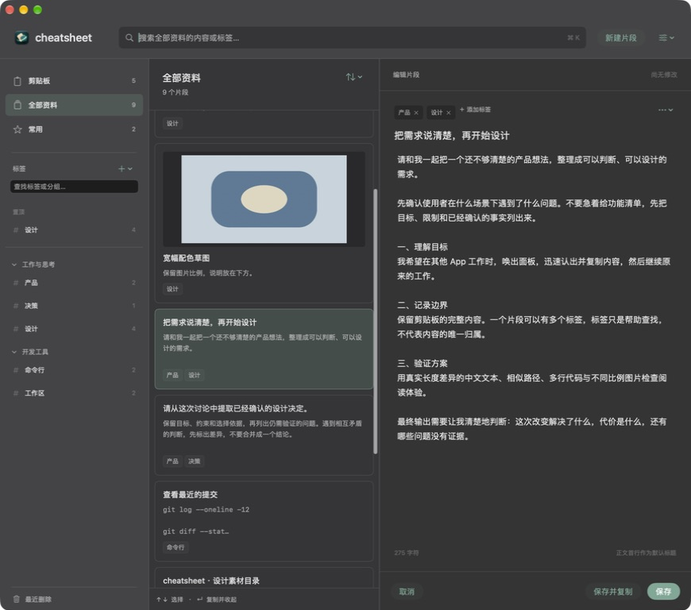

# 中性灰绿主题与卡片精简

2026-09-14，Issue #7 / PR #8。实现提交 `e35535bc3b6ad6323466ebe62345f10b73a3a806`。

正文阅读与编辑使用纯中性灰，深色为 white 0.205，浅色为 white 0.96；保留原生磨砂的环境融合。强调色使用低饱和灰绿色，深色 RGB 0.47/0.66/0.59，浅色 RGB 0.21/0.43/0.35；CabinetPalette 和全局 AccentColor 资源一致，主窗口和设置同步使用。左上角通过当前 App bundle 读取真实应用图标，复用在设置窗口中。

移除卡片右下角“查看”按钮及其预留空间，保留整卡单击复制和右侧全文/编辑。卡片边框与间距保留，选中描边使用新的绿色。

## 验证与边界

本机 xcodebuild 成功；日志 `/tmp/cheatsheet-cabinet-green.log`。构建参数沿用 feedback.md，derivedDataPath 为 `/tmp/cheatsheet-cabinet-green`，独立 bundle id 为 `zhouqiaaha.top.cheatsheet.cabinet-preview.green`。`git diff --check` 通过。

实际原生窗口已显示真实图标、中性灰阅读和编辑区、绿色选中状态与按钮；无卡片查看按钮，整卡点击后出现“已复制”，窗口保持打开。下方截图直接来自运行中的隔离 App。浅色资源和主题绑定已更新并编译通过，本轮切换操作多次因窗口状态变化中断，未完成新的浅色运行截图验证，不能引用上轮蓝色主题截图作为本轮绿色浅色证据。

本轮只修改外观、图标及移除独立查看入口，没有修改 schema、复制实现、备份或监控；不重复运行此前的存储检查。当前运行包 `/tmp/cheatsheet-cabinet-green/Build/Products/Debug/cheatsheet.app`，仍使用模拟数据、命名剪贴板与 **⌘⇧⌥C**。正式 App 和数据库未替换，保留用户当前试用窗口状态。

