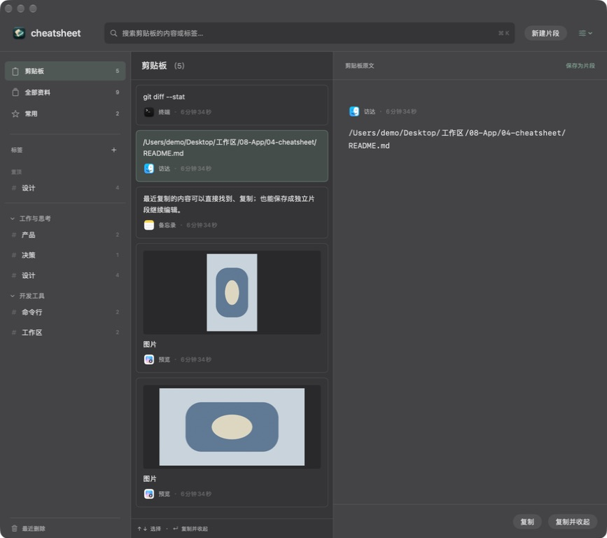
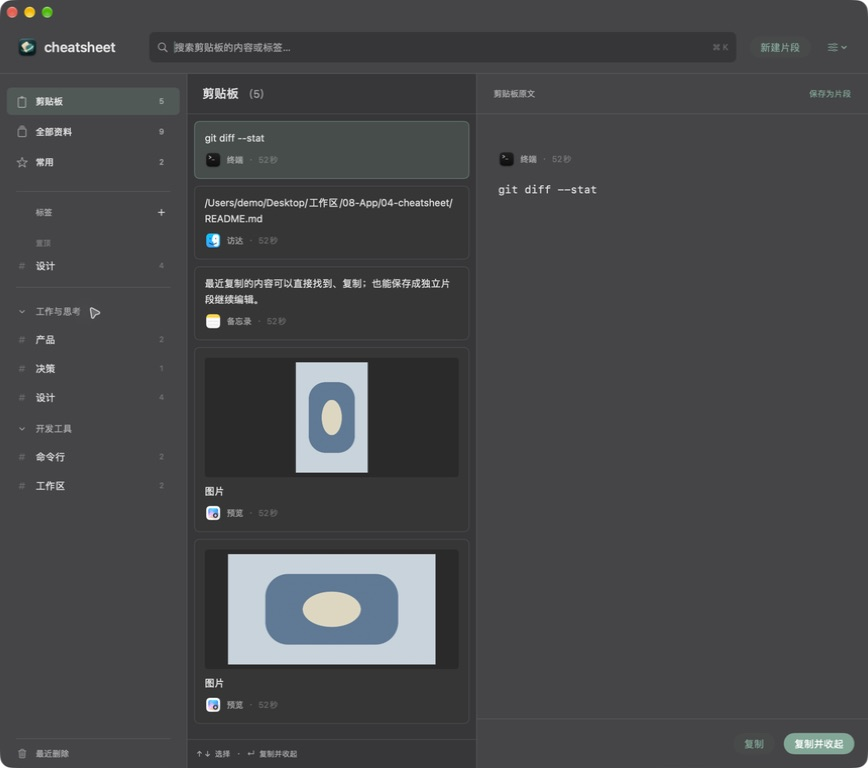

# 左侧栏对齐

2026-09-14，Issue #7 / PR #8。起点 93f77d4，实现提交 `5e17493178eb555efd841647fbe653679a9bc36b`。

目视原生窗口发现：标签名称比主导航更靠左，分组箭头和标签符号宽度不一致，加号比数量偏左，分隔线两端也有不同缩进。修订仅涉及 CabinetView 的侧栏布局：16pt 图标槽、10pt 图文间距、24pt 操作与数量槽、12pt 行内水平边距；标题对齐文字列，加号与数量按同一槽居中。最近删除与主导航共用相同结构，分组按钮恢复完整行点击范围。





构建命令：

```sh
DEVELOPER_DIR=/Applications/Xcode-beta.app/Contents/Developer \
xcodebuild -project cheatsheet.xcodeproj -scheme cheatsheet \
  -destination 'platform=macOS' \
  -derivedDataPath /tmp/cheatsheet-cabinet-sidebar \
  PRODUCT_BUNDLE_IDENTIFIER=zhouqiaaha.top.cheatsheet.cabinet-preview.sidebar \
  CODE_SIGN_IDENTITY=- CODE_SIGN_STYLE=Manual DEVELOPMENT_TEAM= build
```

BUILD SUCCEEDED；日志 `/tmp/cheatsheet-cabinet-sidebar.log`，git diff --check 通过。实际点击加号直接出现新建标签对话框，取消后返回；工作与思考分组可折叠并展开。截图目视确认主导航、标签/分组文字起点、右侧加号/数量及分隔线边距一致。本轮拖动侧栏分隔线未观察到宽度变化，因此不将较窄侧栏记为已验证；截图对应当前常规宽度。未新增机械布局测试，未重复运行未修改的存储、输入和复制检查。

隔离版 `/tmp/cheatsheet-cabinet-sidebar/Build/Products/Debug/cheatsheet.app` 正在运行，⌘⇧⌥C 唤出。正式 App、数据库、系统剪贴板不变；PR 保留 Draft，未合并。这里只记录实施者目视检查，不代表独立审查或用户验收。
