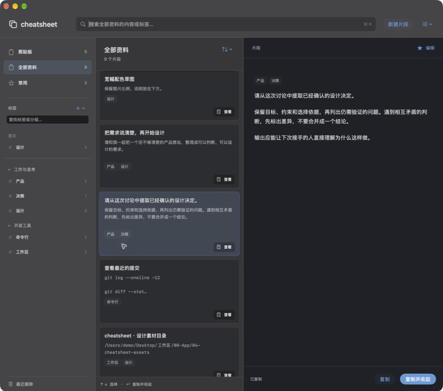
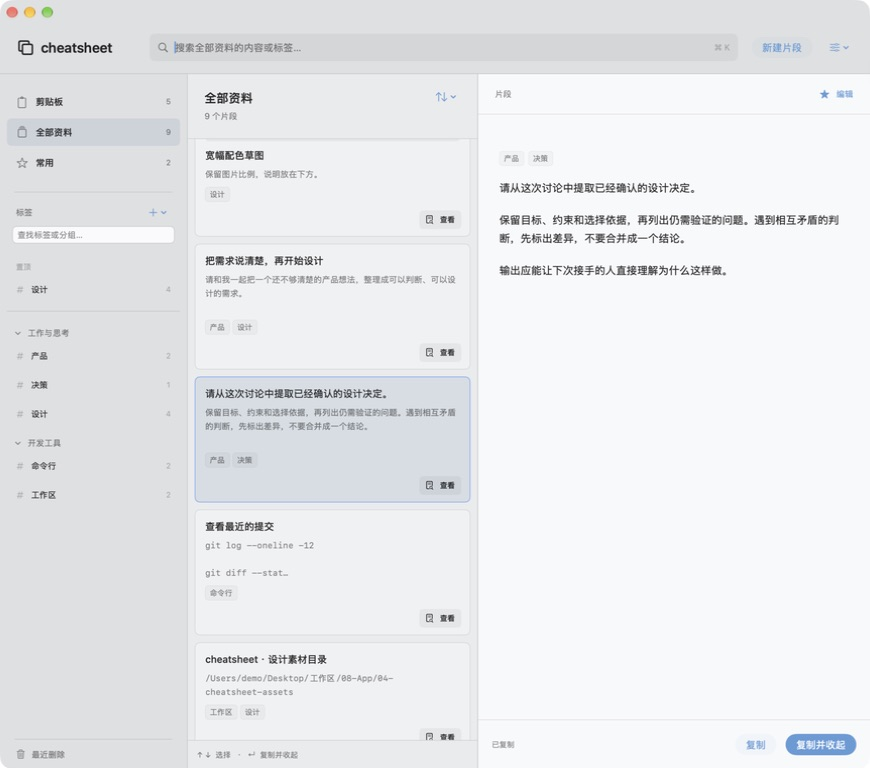

# 整卡单击复制与卡片边界

2026-09-14，Issue #7 / PR #8。实现提交 `a5bd1d6e29118a79c5f3f35aae92c4e3e3e1c99d`。

Karl 澄清单击复制指整张卡片。本轮将整卡主按钮改为选择并复制，保留未保存保护与原复制方法；独立“查看”按钮位于卡片右下，只打开全文。两者是同级按钮，不使用嵌套按钮，边框不拦截点击。复制仍保持窗口打开。

卡片增加轻底色、1pt 细边框和9pt间距，选中项加强描边。深浅模式都用同一结构强调对象范围。设置和 README 的交互说明已同步更新。

## 验证结果

本机 xcodebuild 成功，日志 `/tmp/cheatsheet-cabinet-whole-card.log`；`git diff --check` 通过。构建参数与 feedback.md 相同，derivedDataPath 改为 `/tmp/cheatsheet-cabinet-whole-card`，独立 bundle id 改为 `zhouqiaaha.top.cheatsheet.cabinet-preview.whole-card`。

实际原生窗口先点击“查看”，右侧显示完整中文正文且没有复制反馈；随后点击卡片下部留白，出现“已复制”，窗口保持打开。确认整卡主按钮包含正文与内部留白，查看按钮独立命中。实际切换深浅模式并保存以下截图。此次只改动 View 的点击绑定与视觉，不重复运行未改动的迁移/备份检查；此前完整检查记录继续保留，不能描述为本轮重新执行。

当前隔离运行包 `/tmp/cheatsheet-cabinet-whole-card/Build/Products/Debug/cheatsheet.app`，快捷键 **⌘⇧⌥C**。旧验收副本已退出；模拟数据与命名剪贴板的边界保持不变，正式 App 和数据库未修改。

