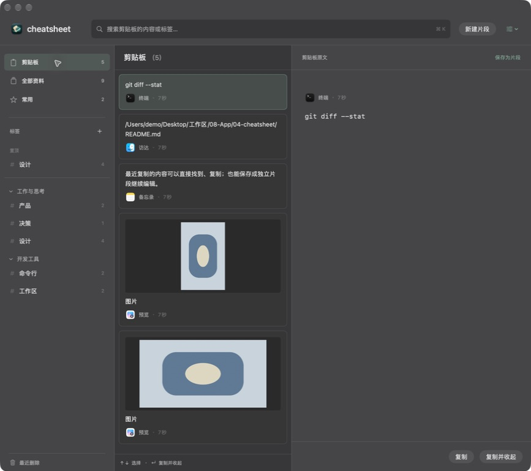
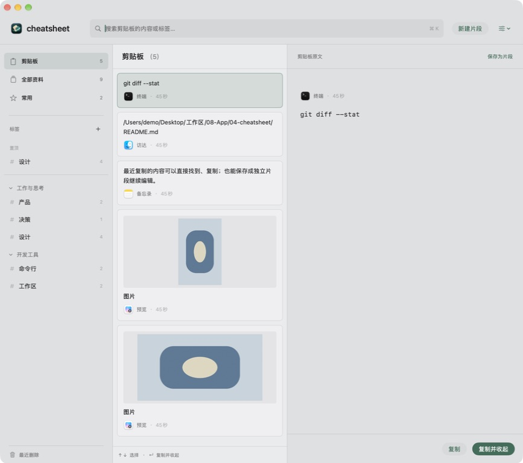
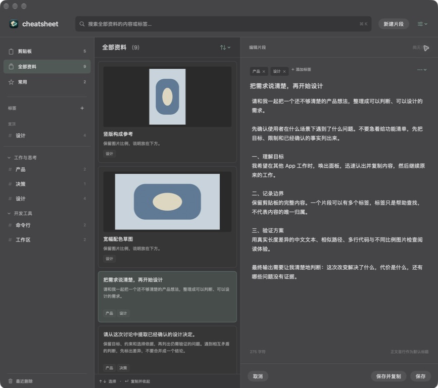

# 窗口层级、来源图标与统一材质

2026-09-14，Issue #7 / Draft PR #8。窗口修复 checkpoint `7cfee06`；最终实测实现 `4f0ec4d4b8c739c8d82ac919c97fe58f625d04d8`。后续提交仅追加说明与截图。验证由实施 Agent 完成。

## 变化与原因

资料柜原来保留 isFloatingPanel=true 和 level=.floating，导致其他 App 激活后它仍压在普通窗口上。现在使用普通窗口层级，切换 App 不自动收起、不抢回焦点；快捷键在后台唤回，前台才收起，保留原有草稿保护和复制返回路径。

剪贴板来源原本只有记录内存在图标数据时才显示一个 13pt 图标，模拟记录仅有名称，因此验收窗口看不到图标。现统一为 22pt 图标加来源名称，优先历史图标，缺失/损坏时按 bundle ID 读取本机 App 图标；无法解析时显示通用 App 符号。模拟数据补充真实 Apple App bundle ID，未改真实采集与存储。列表和右侧原文区都展示来源。

右侧移除纯色遮罩，与左侧共享根视图的 NSVisualEffectView。文本编辑器和滚动容器仍透明；中列卡片边界与轻底色保留。标签旁加号由 Menu 改为 Button，直接新建标签，没有下拉箭头；标签与分组右键菜单及全局分组入口继续保留。

## 构建及回归

```sh
DEVELOPER_DIR=/Applications/Xcode-beta.app/Contents/Developer \
xcodebuild -project cheatsheet.xcodeproj -scheme cheatsheet \
  -destination 'platform=macOS' \
  -derivedDataPath /tmp/cheatsheet-cabinet-material \
  PRODUCT_BUNDLE_IDENTIFIER=zhouqiaaha.top.cheatsheet.cabinet-preview.material \
  CODE_SIGN_IDENTITY=- CODE_SIGN_STYLE=Manual DEVELOPMENT_TEAM= build

DEVELOPER_DIR=/Applications/Xcode-beta.app/Contents/Developer \
python3 scripts/verify_core_behaviors.py /tmp/cheatsheet-cabinet-material --cabinet
```

构建成功，日志 `/tmp/cheatsheet-cabinet-material.log`；检查最终退出 0，日志 `/tmp/cheatsheet-material-checks.log`。新增检查覆盖保存图标解码、损坏数据回退到已安装 App、未知 App 返回空值供通用符号显示。首次检查因测试夹具创建了没有位图内容的 NSImage，强制解包 TIFF 时失败；补充实际绘制后重新运行通过，未改变产品代码掩盖失败。

```text
PASS: v1 SQLite migration preserves IDs, full body, title, order, favorite and pin; adds tag relation
PASS: multi-tag, optional title, no-tag save, non-destructive deletion, rename and group restore conflicts
PASS: history source dedup and original protection; v2 JSON roundtrip covers groups, images, no tags and origin; imports v1
PASS: original file URL, URL, RTF and HTML payloads survive copying
PASS: full-body tail search, exact copy on isolated pasteboard, clipboard query and selection restoration
PASS: background clipboard save merges on main and becomes searchable without reopening
PASS: mouse selection does not scroll; keyboard selection requests visibility; IME composition waits for Chinese commit
PASS: clipboard source icon uses saved data, falls back to installed app, and tolerates missing apps
PASS: disk store closes and reopens with image and multi-tag assets intact
```

## 实际窗口

从资料柜切到计算器并点击窗口，计算器正常激活，红绿灯处于活跃状态；在计算器按 ⌘⇧⌥C，资料柜回到前台并恢复搜索焦点。标签加号直接出现“新建标签”对话框，取消后返回，不经过选项菜单。深浅阅读均看到访达、终端、备忘录与预览图标；编辑区确认与左侧相同的材质。未修改或保存测试草稿。







隔离版路径 `/tmp/cheatsheet-cabinet-material/Build/Products/Debug/cheatsheet.app`，⌘⇧⌥C 唤出。正式 App、真实数据库和系统剪贴板未修改。没有将截图中的静态色块外观当成背景模糊强度测量；材质机制由共享原生视图与透明编辑容器确认。多屏/全屏、降低透明度实机切换、独立 Review 与性能尚未全面验收。PR 保留 Draft，未合并或发布。
