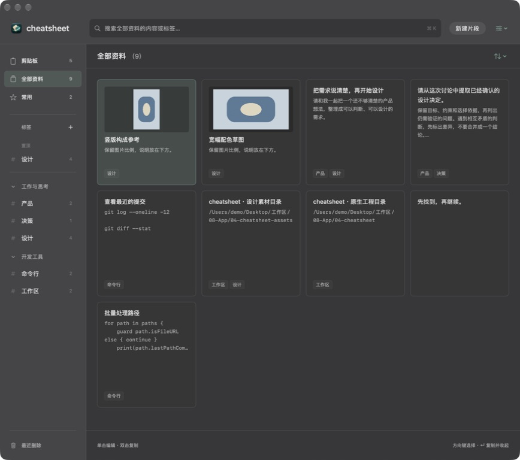
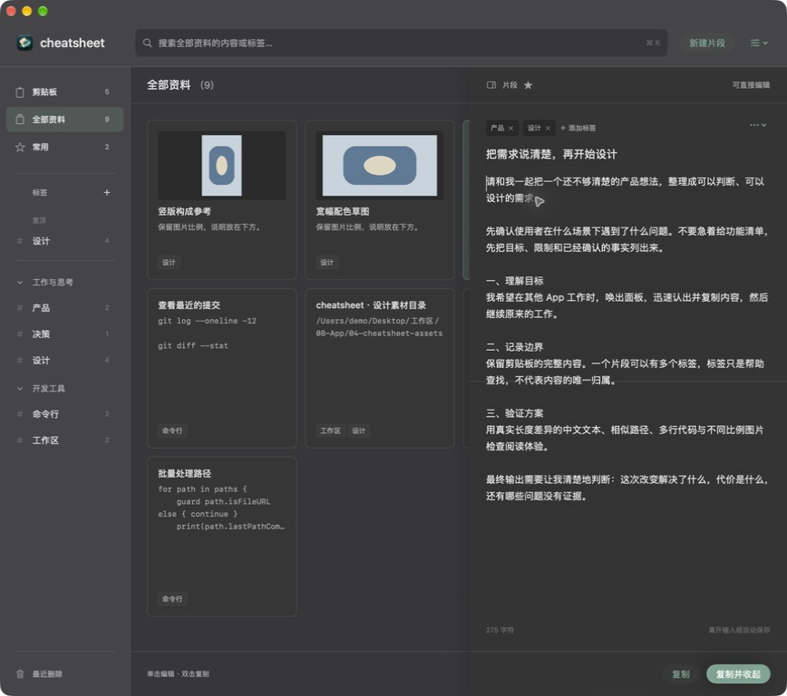
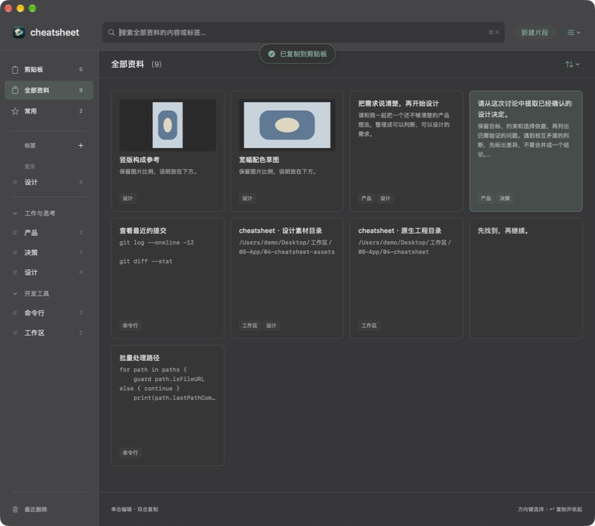
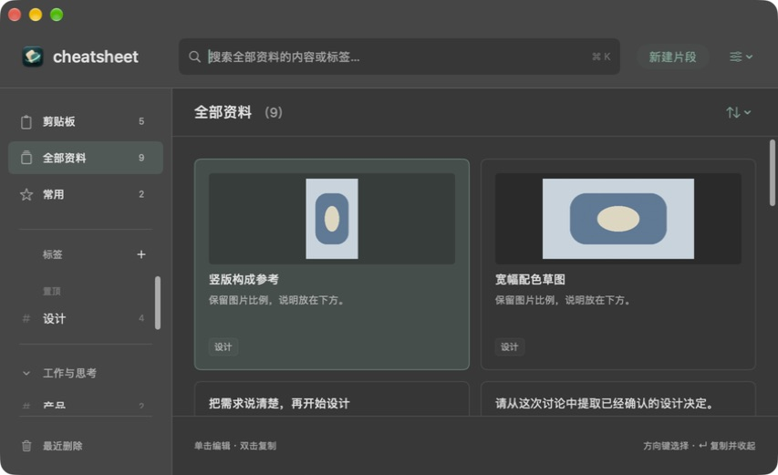
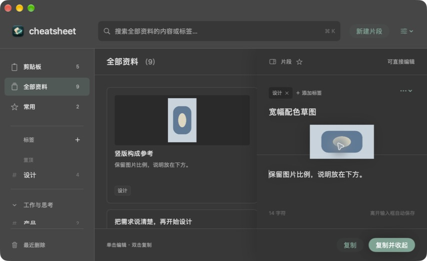

# 网格与按需编辑面板验收

2026-09-15，Issue #9 / Draft PR #10，实现 checkpoint `f17b2d101874a222f922e36eea2788b91a53c71d`。Karl 的最新要求为默认平铺片段网格、单击从右侧打开编辑面板、双击仍复制。此次替代常驻三栏，保留之前的自动保存及性能修复。

## 实际窗口

使用独立 bundle ID `zhouqiaaha.top.cheatsheet.cabinet-preview.grid`、内存模拟数据及命名剪贴板。以下图片只有模拟内容，不含正式库内容。实际窗口验证了默认四列、通过系统 Move & Resize 缩窄后两列、右侧单击编辑、左右两侧双击复制、搜索收起、Esc 保存后重新打开读回中文与表情、图片比例及窄窗口底部按钮。

| 场景 | 证据 |
| --- | --- |
| 默认网格，没有常驻编辑区 |  |
| 单击直接编辑，卡片不重排 |  |
| 双击最右卡片，复制后回到网格 |  |
| 缩窄后两列 |  |
| 窄窗口图片与编辑按钮 |  |

## 构建与行为检查

Xcode 27 beta，macOS，arm64。Debug 和 Release 构建成功，Release ad-hoc 签名通过 `codesign --verify --deep --strict`。通过 `scripts/verify_core_behaviors.py /tmp/cheatsheet-grid-build --cabinet` 链接真实应用对象执行检查，并开启 Core Data 并发检查；不带 `--cabinet` 的基础排序、搜索、导入与窗口输入检查也全部通过。这是项目自带的 Swift 行为检查程序，不是 XCTest target。

新增检查覆盖默认面板关闭、单击立即展开、收起保存、无效正文不能收起、搜索/导航收起、双击复制原始对象、鼠标位置与时间边界、已打开面板中的双击及空白新建取消。原有 Unicode、IME 组合输入、失焦回调、保存失败重试、后台刷新、只读原文、多标签/图片与磁盘重启检查也全部通过。本次没有重新声称点击到首帧的耗时；前轮文字布局性能数据继续保留在历史记录。

## 本机安装与数据核对

Release 已安装至 `/Applications/cheatsheet.app`。安装前正常退出旧应用，保存整份数据库目录、外置附件、偏好及旧 App 到本机备份 `~/Library/Application Support/cheatsheet-migration-backups/20260915-150021-grid`。未用早期诊断副本覆盖现有数据。

新版启动后只读逐行比较：78 个片段、20 个标签、585 条历史、78 条标签关系、1 个标签分组全部一致；78 个外置文件的 SHA-256 一致。永久保留历史的偏好仍为 0。真实窗口已显示网格且没有常驻编辑器。

旧 App 可执行文件 SHA-256：`bf865d1b681ca3fbd83eaca6706ab32ea759405ea3d0a8fad685e964ac227c44`；新 App：`f58e4e0e5eaa2b15dbde3a0a8974cac2955f2a10027fe93e94afa001dc794682`。回退前必须保护安装后新增内容；本次没有执行回退或删除备份。PR 保持 Draft，尚未合并。
