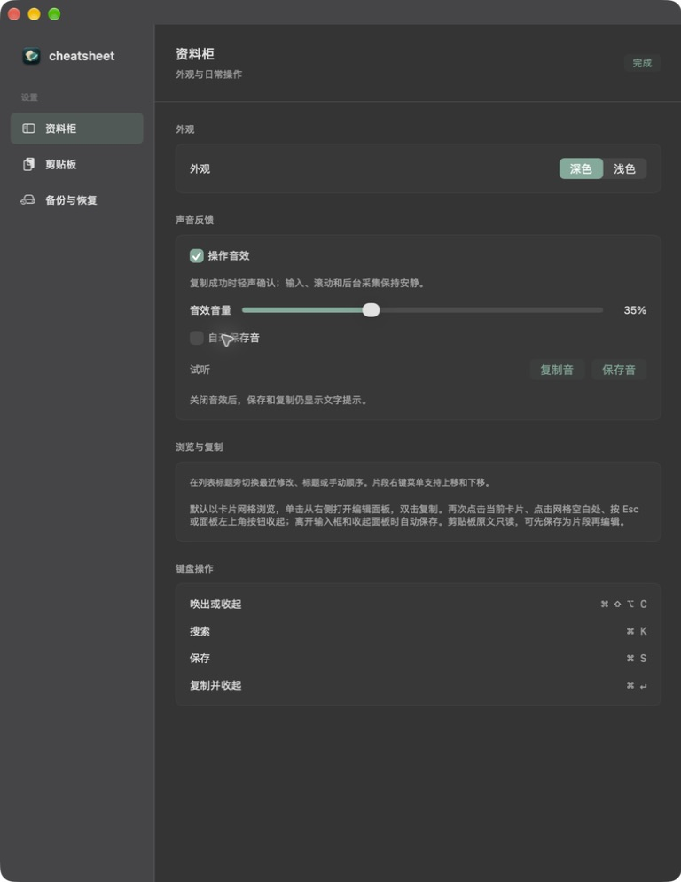
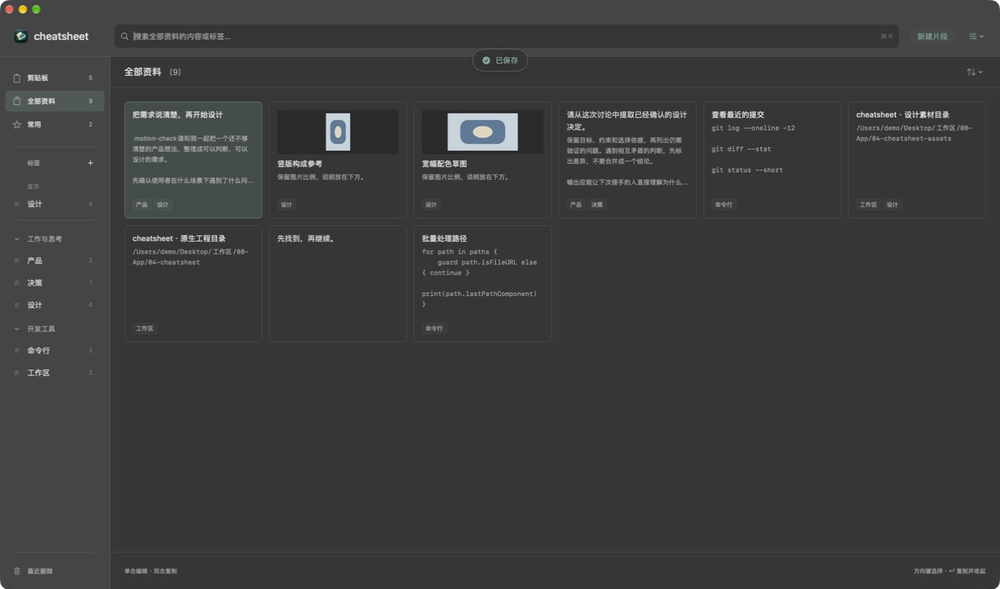
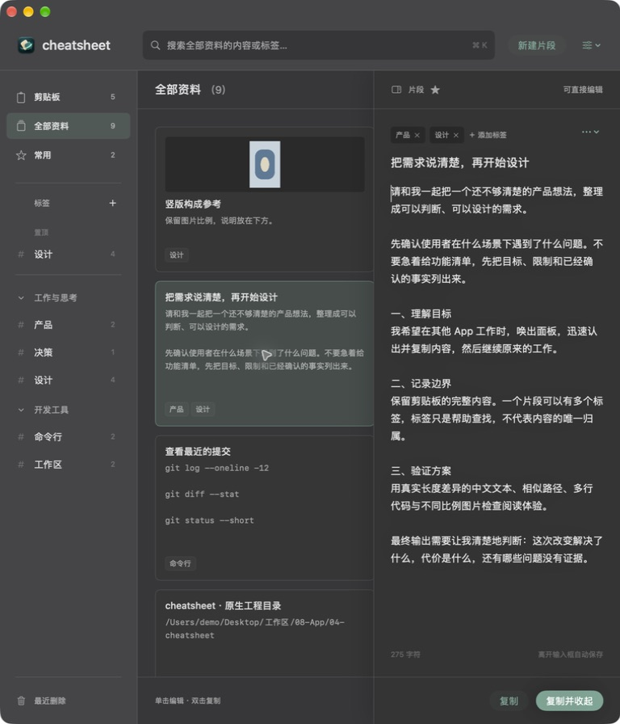

# 磨砂卡片轻轻落位：微动效与声音

2026-09-15，关联 [Issue #9](https://github.com/airsulG/cheatsheet/issues/9) / [Draft PR #10](https://github.com/airsulG/cheatsheet/pull/10)。Karl 明确授权实现，并要求复用现有面板和成功提示、保持高频操作即时响应。实现、Debug / Release / 隔离行为检查和本机安装已完成；最终版的真实设置操作、宽窄窗口及系统 Reduce Motion 下的行为也已检查。**主观听感、声画同步及完整动画录像仍未完成**，不能标为完整体验验收通过。

## 已实现的体验

你先找到卡片，单击立即编辑，双击复制，然后继续其他工作。动效仅帮助辨认按下、空间方向和完成结果；保存/复制成功由真实写入决定，按下卡片不提前宣告成功。

| 位置 | 本轮行为 | 保留的边界 |
| --- | --- | --- |
| 卡片 | 悬停底色/边线 100ms；按下立即 0.99，松开 100ms 恢复 | 不抬升、不改变尺寸/点击范围，不加单击计时器 |
| 编辑面板 | 复用右侧 200ms 过渡，可继续切换或反向关闭 | 网格不重排，焦点不等待动画，正文不逐字出现 |
| 成功提示 | 140ms 淡入及 5pt 位移，勾选 0.92→1；100ms 退出 | 两秒展示，最新文字直接替换，保存紧接复制不重播入场 |
| 标签 | 仅选中底色 100ms 变化 | 同步更新结果，无网格依次入场或导航等待 |
| 星标 | 加入后填充，1→1.04 的小幅弹性变化；取消恢复轮廓 | 先真实保存，失败恢复星标和时间戳；键盘操作不加该动画 |
| Reduce Motion | 保留短淡入/颜色变化，取消位移与缩放 | 声音设置独立，无循环装饰或持续动画任务 |

本轮保留已有面板空间方向和成功提示，没有再叠加第二个弹层、整卡悬浮或网格弹跳；没有加入粒子、视差、循环装饰、逐字动画或失败正文抖动。原有卡片 200pt 高、14pt 内距、12pt 网格间距保持。

## 声音与权限

两段声音由 `scripts/generate_cabinet_sounds.py` 使用正弦、确定种子的噪声和衰减包络原创合成，无外部录音、下载素材或第三方样本。资源和来源说明位于 `cheatsheet/Resources/InteractionSounds/`，可随项目使用、修改、分发。

复制音 105ms，保存音 75ms，均为 48kHz / PCM16 / 单声道。保存音峰值低于复制音，起音柔和、尾部淡出；这描述合成参数，**不代表已经主观试听通过**。默认主动复制成功发声，保存音关闭，独立音量 35%。设置提供总开关、自动保存音开关、音量和两种试听，关闭声音仍完整显示文字提示。悬停、输入、搜索、滚动及后台采集无声音路由。

启动预读到内存并准备播放器；点击路径不联网、不读文件。每次仅播放一段，打断时 pause 并重置位置，自然完成后重新 prepareToPlay。复制间隔不足 120ms 限制声音；启用的保存音等待 80ms，以便紧接复制时取消保存音，保存与前一声音相距不足 300ms 也不播放。保存和剪贴板写入本身都不等待这些时间。

## 可重复的验证

代码基线 `4f78ae6`。基线工具提交 `17ca447` 的只读 accessibility 环境键编译问题已在 `9888736` 修正，以下仅使用修正后有效测量。动效实现 `4e3c3a7`，声音、偏好与验证实现 `df94eca`，分别可撤销；本轮未修改数据模型。

Debug 使用 Xcode 27 beta、macOS arm64，优化 `-O` / `ENABLE_TESTABILITY=YES`；Release 使用本机 ad-hoc 签名。两者构建成功，`codesign --verify --deep --strict` 成功。隔离测试打开 Core Data 并发断言，使用内存/临时磁盘库和命名剪贴板，不写正式库。

```sh
DEVELOPER_DIR=/Applications/Xcode-beta.app/Contents/Developer \
python3 scripts/verify_core_behaviors.py /tmp/cheatsheet-grid-build --cabinet

# 明确允许测试程序实际请求播放；不等于听感验收。
CHEATSHEET_VERIFY_AUDIO_PLAYBACK=1 \
DEVELOPER_DIR=/Applications/Xcode-beta.app/Contents/Developer \
python3 scripts/verify_core_behaviors.py /tmp/cheatsheet-grid-build --cabinet

DEVELOPER_DIR=/Applications/Xcode-beta.app/Contents/Developer \
python3 scripts/verify_cabinet_motion.py /tmp/cheatsheet-grid-build

CHEATSHEET_RENDER_SETTINGS=/tmp/cheatsheet-grid-audit/motion-images \
DEVELOPER_DIR=/Applications/Xcode-beta.app/Contents/Developer \
python3 scripts/verify_cabinet_motion.py /tmp/cheatsheet-grid-build
```

完整 `--cabinet` 检查退出 0。新增验证默认偏好、限频、保存后复制合并、静音/音量零、取消待播、偏好实例回读、无修改不发声、真实保存成功路由和失败静音。真实 AVAudioPlayer 完成 prepare，接受复制→保存→再次复制播放请求；测试留出各声音播放时间。没有音频回采，因此只证明播放器调用，不证明扬声器输出、听感或声画同步。

NSHostingView 中每隔 25ms 反向关闭，连续十轮展开/关闭并修改正文：每次草稿保存正确，最终只存在一个编辑控件。星标十轮快速切换后持久化状态正确；注入保存失败时恢复字段。原有自动保存失败保护、原生 NSTextView 的中文组合输入与失焦回调、全文 Unicode 复制、搜索焦点相关状态、网格单/双击源对象与位置时间边界、旧会话隔离、图片、多标签、后台合并和磁盘关闭重开继续通过。这些状态/控件检查不能证明屏幕动画每帧连续。

## 性能对照

同一原生 NSHostingView 夹具：80 个模拟片段、4 个标签，1140×740pt；新建宿主并同步布局，预热两次，取十次，导航 200 次。没有插入人为等待到点击、保存或导航路径。

| 分项中位数 | 修改前 | 动效提交后一次 | 最终构建一次 |
| --- | ---: | ---: | ---: |
| 网格初始布局 | 42.490ms | 45.248ms | 36.160ms |
| 编辑面板初始布局 | 62.321ms | 61.868ms | 50.324ms |
| 无界面标签导航 | 0.084ms | 0.086ms | 0.082ms |

最终测量在构建和行为检查结束后单独运行。后台应用负载没有完全控制，网格中位数在 36–45ms 间波动，不能据此声称动效让布局更快，也不能排除几毫秒的增量。尚未测量点击到首帧、GPU 成本、持续帧率或声音启动延迟。日志：`motion-before.log`、`motion-after.log`、`sound-final-performance.log`，均在本机 `/tmp/cheatsheet-grid-audit/`。

## 实际窗口与组件证据

动效版隔离窗口曾实际完成右侧卡片双击复制、单击立即进入正文，以及常用星标切换、侧栏数量变化。随后原生窗口工具持续返回 `cgWindowNotFound`；预览、系统设置及其他应用均无法读取窗口，原因未确定。尝试系统录屏入口未成功，工具也未提供可用的原生录像能力，没有完整记录触发、收尾和中途反向过程。

后续窗口连接恢复，正常退出旧隔离进程并启动最终构建，实际打开声音设置。界面确认总开关开、保存音关、音量 35%；两种试听按钮均实际点击。将隔离版音量改到 22%、开启保存音后，界面读回对应数值。工具提示用户正在改变该 App 时停止鼠标操作，Karl 明确回复“可以继续验收”后继续。期间用户将音量调至约 52%，随后关闭总音效，界面正确禁用音量、保存音及试听按钮。

正常退出并重新启动隔离版后，设置仍保留总开关关闭、约 52% 音量和保存音选中，完成真实重启回读。最后恢复默认总开关开启、35% 音量、保存音关闭，界面读回确认。静音状态下编辑后复制、输入 `motion-check` 后点击网格空白、右侧卡片双击分别显示最新复制/保存提示，面板关闭和正文保存可见。此后再次启动隔离版检查六列宽网格及原生半屏窗口的两列网格，标签、输入区和底部按钮没有重叠，单击仍立即聚焦正文。最后正常退出隔离进程。

实际进入系统设置，确认“减弱动态效果”原值为 off，临时改为 on；隔离版打开片段立即聚焦，Esc 收起，⌘K 搜索 `git` 保留搜索焦点并筛到一条记录，双击复制提示正常。之后将系统偏好恢复为 off 并读取确认。没有主张这些终态检查证明了所有动画帧都符合预期。

尝试逐帧采集实际窗口：展开 click 调用返回时约 842ms，首帧取得时约 1434ms；另一次将关闭操作与截图请求并行，click 返回约 285ms，首帧仍到 1002ms 才取得。采集已经错过 200ms 动画，因此保留时间记录，不把前后静态图拼成假录像。25ms 反向动作由原生宿主测试覆盖状态和保存正确性，屏幕中断过程仍缺录像证据。

以下由真实 AppSettingsView 在 NSHostingView 离屏渲染，检查 720×540 和 780×600 的排版。声音控件可见且不重叠，窄尺寸下其他内容继续滚动。**它们不是实际桌面截图，也不证明控件点击或动画效果**；测试宿主的 App 图标为通用占位，不是应用资源变更。

组件渲染：[720pt](motion-images/settings-720.png)、[780pt](motion-images/settings-780.png)。下列则是最终版的实际隔离窗口截图，所有正文均为模拟内容。







补充：[静音设置](motion-images/settings-muted-live.jpg)、[保存后复制](motion-images/copy-muted-live.jpg)、[右侧卡片双击复制](motion-images/double-copy-live.jpg)、[两列网格](motion-images/grid-narrow-live.jpg)、[减少动态效果下复制](motion-images/reduce-motion-live.jpg)。

音频被提交给可用工具时，工具明确返回不支持音频输入，因此无法实际听到起音、尾音、响度与连续播放的主观效果。未声称“试听通过”。尚缺主观听感、连续播放的听觉检查、声画同步、从触发到结束及中途反向的完整录像和精确帧率；静态截图仅用于布局和终态，不代替这些体验项目。

## 交付与下一次继续的位置

新签名 Release 从本机 `/tmp/cheatsheet-grid-release/Build/Products/Release/cheatsheet.app` 安装到 `/Applications/cheatsheet.app`，代码版本 df94eca。更新前实际日常窗口处于网格，没有编辑草稿；通过原生退出正常结束进程，安装脚本再次核对进程已退出。完整保留当时最新数据库、外置文件、偏好和旧 App，然后原子移动暂存 App 到正式路径。备份位于 `/Users/zhouqi/Library/Application Support/cheatsheet-migration-backups/20260915-183345-grid`。

安装前后只读逐行比较：79 个片段、20 个标签、595 条历史、79 条标签关系、1 个分组全部相同，81 个外置文件 SHA-256 相同；永久保留偏好仍为 0。新进程来自正式路径，已恢复更新前查看的“降智测试”标签，没有修改该标签或片段。正式窗口截图和用户数据库没有上传。

旧执行文件 SHA-256：`db7f8114d5a7cec10dcc62f8e639efd455545eabc746a539211a1698a762ec1c`。
新执行文件 SHA-256：`1974ea527841c3e4c1eea92464628a773340337c5b6c8d6fb3ab448aea2b81cc`。构建、暂存和安装后的签名校验均成功。回退应先保护之后新增的数据，不以旧快照覆盖；本轮未执行回退演练。

下一次验收只需补齐听感和真实动画过程，若根据听感调整音量或包络，再验证连续复制与保存覆盖。保留 Draft PR，等待体验判断和合并决定，不自动合并。
