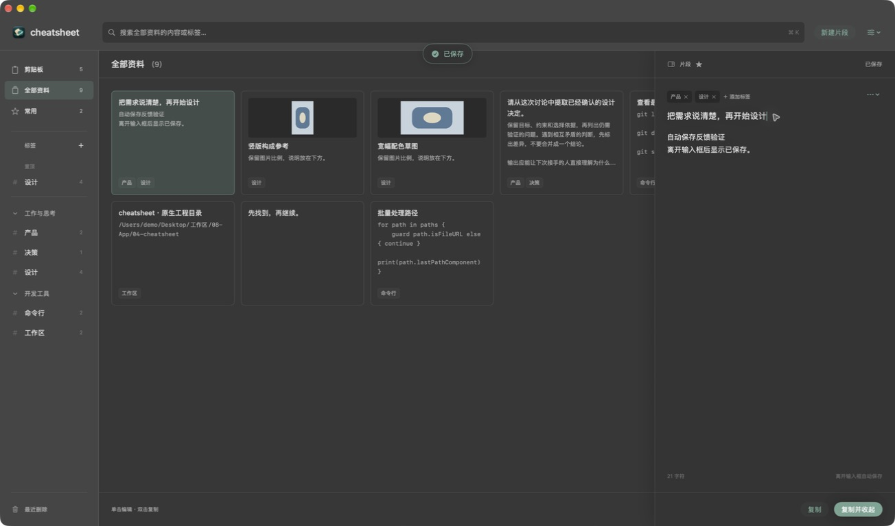
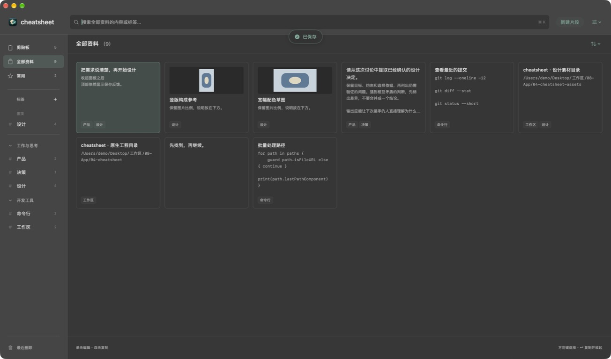
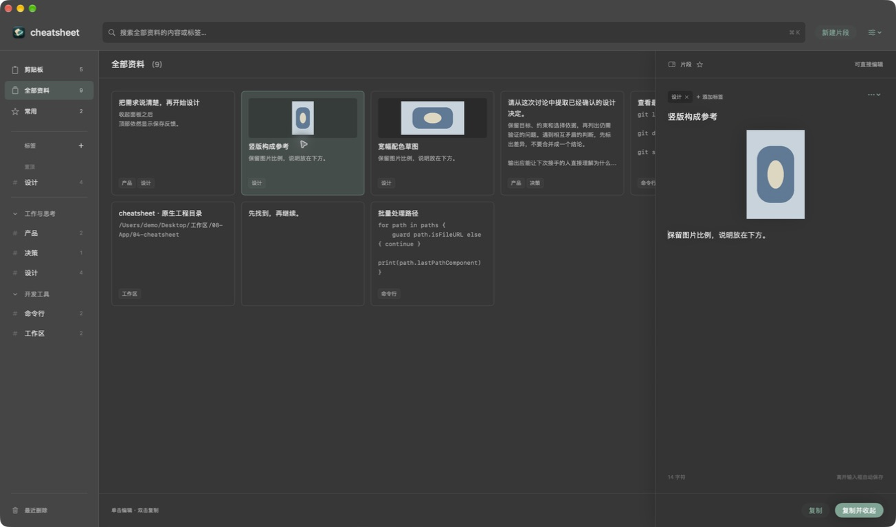
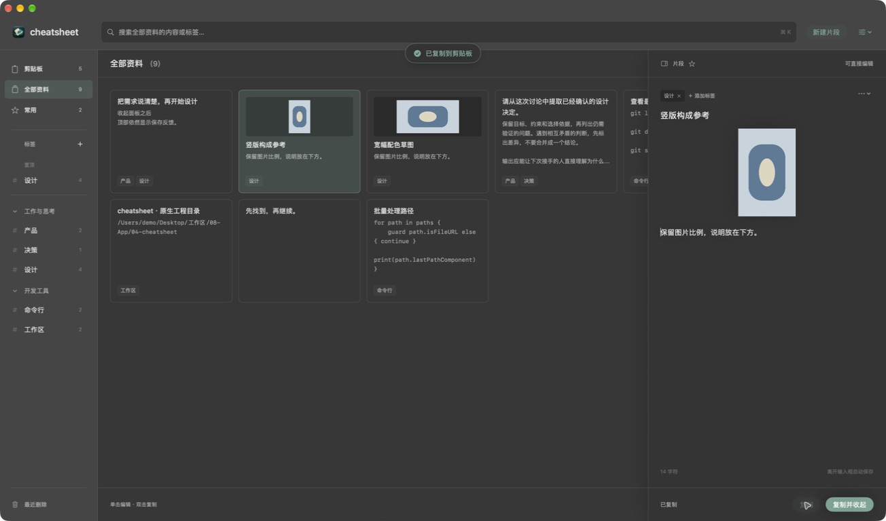

# 编辑区横线与保存反馈验收

2026-09-15，Issue #9 / Draft PR #10，实现 `5058dcaaf37c4772a67b145e1aa0334102af399f`。用户指出编辑区中间异常横线，并要求自动保存后提供与复制一致的反馈。

## 修复与行为

横线来自右侧面板 `.overlay(alignment: .leading) { Divider() }`：对齐方式并没有指定分隔线方向，它在叠层中横向绘制。现改为宽 1pt、靠左的 Rectangle，文字及图片编辑面板中间不再出现横线，顶部和底部正常分区线保留。

保存与复制使用同一个顶部胶囊提示：真实保存成功后显示“已保存”，复制成功显示“已复制到剪贴板”，两秒后消失。下一次成功操作取消上一轮计时，显示最新结果；保存后立刻复制最终显示复制结果。没有修改、空白新建不触发成功提示，保存失败清除旧成功提示、保留草稿和原有失败说明。提示在窗口根部，编辑面板收起后仍能看到。

## 验证

Debug 和 Release 构建、Release 签名验证通过；`scripts/verify_core_behaviors.py /tmp/cheatsheet-grid-build --cabinet` 完整通过，启用 Core Data 并发检查。新增检查覆盖真实保存提示、无变化/空白不提示、面板关闭后仍提示、保存后复制覆盖、失败清除旧成功提示、重试和自动消失。原有自动保存、IME、重复点击收起、双击复制、存储与重启检查继续通过。本轮未重复基础排序/导入检查，未声称新增独立 Review 或远端 CI。

隔离原生窗口验证正文失焦出现顶部“已保存”、Esc 收起后仍显示、复制提示一致，以及短文和图片编辑面板无异常横线。正式安装后打开用户报告的同一片段，目视核对中部横线消失；未修改该片段。下列截图只包含独立内存演示内容，正式数据截图不上传。

| 场景 | 证据 |
| --- | --- |
| 短文失焦保存 |  |
| 面板收起后保存反馈 |  |
| 图片编辑区无中部横线 |  |
| 同样式复制反馈 |  |

## 安装与数据

已安装至 `/Applications/cheatsheet.app`。备份目录 `~/Library/Application Support/cheatsheet-migration-backups/20260915-154224-grid` 保存旧 App、完整数据库目录、外置文件和偏好。正常退出旧进程后备份，新版启动后只读逐行比较 78 个片段、20 个标签、590 条历史、78 条标签关系、1 个分组均一致；80 个外置文件 SHA-256 一致，永久保留偏好仍为 0。

旧 App SHA-256：`ef0c017d5320d51a5991fae53ce97721133a5194bac6f91c4aeeca465c8879f6`；新 App：`db7f8114d5a7cec10dcc62f8e639efd455545eabc746a539211a1698a762ec1c`。未合并 PR，未执行回退；回退前需保护安装后的新增内容。前轮记录见 [网格及密度验收](grid.md)。
